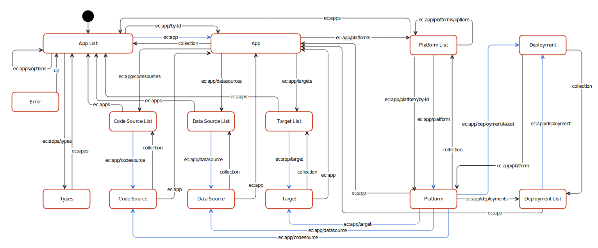

# App Manager API 

The entrecode App Manager API is *REST API,* or rather *Hypermedia API.* This means that the term *REST* is actually understood as [intended by Roy T. Fielding](http://www.ics.uci.edu/~fielding/pubs/dissertation/top.htm) – including the *Hypermedia Constraint.* See [this blog post](http://roy.gbiv.com/untangled/2008/rest-apis-must-be-hypertext-driven) for a more in-depth description of REST and the difference to a simple HTTP-based API which is often mistakenly called *REST API.*

In short, data is partitioned in *resources* which manifest in *representations.* Those are transferred using a *standardized format* ([JSON HAL](https://tools.ietf.org/html/draft-kelly-json-hal-06)) with *standardized methods* (HTTP/1.1, [RFC 7230](http://tools.ietf.org/html/rfc7230)). Application flow between resources is defined by link relations. URLs are subject to change and must not be hard coded. Instead, link relations can be used to explore and use the APIs.

* **Entry Point:** [https://appserver.entrecode.de/](https://appserver.entrecode.de/)
* **[Richardson](http://martinfowler.com/articles/richardsonMaturityModel.html) Maturity Level:** 3 (full Hypermedia)
* **Media Type:** `application/hal+json` ([HAL](https://tools.ietf.org/html/draft-kelly-json-hal-06))
* **Root Resource:** `ec:apps` [(App List)](app_manager_resources/app#list)
* **Authentication:** Bearer Token aquired using the [Account Server API](../Account_Server/basics/)

## State Diagram

## Workflow

An [App](app_manager_resources/app) is a single, isolated entity. All other resources are dependent on a single App – they cannot be shared between Apps. 

An App can have a arbitrary number of [Platforms](app_manager_resources/platform). A Platform is a special configuration for building the App. It consists of exactly one [CodeSource](app_manager_resources/codesource), exactly one [DataSource](app_manager_resources/datasource) and at least one (but possible more) [Targets](app_manager_resources/target). Dependent on its type, the platform will build a specialized product when a [Deployment](app_manager_resources/deployment) is created.

Available CodeSource Types, DataSource Types, Target Types and Platform Types can be obtained by getting the [Types](app_manager_resources/types) resource. There may be dependencies: a type may require an explicit platform (e.g. the TargetType 'App Store' could only work with the PlatformType 'iOS').

When creating a [Deployment](app_manager_resources/deployment) for a [Platforms](app_manager_resources/platform), the App Server will obtain Code from the [CodeSource](app_manager_resources/codesource), Data from the [DataSource](app_manager_resources/datasource), then build it according to the [Platforms](app_manager_resources/platform) and finally publish it to all configured [Targets](app_manager_resources/target) of the Platform.

A [Deployment](app_manager_resources/deployment)

## Link Relations

Link Relation names are those registered with the [IANA](http://www.iana.org/assignments/link-relations/link-relations.xhtml). Additionally, custom link relations are used which are built in the form `https://doc.entrecode.de/en/latest/App_Manager/#link-relations/<relation>`. Those relations are also links to their own documentation (on this page). 
For brevity, [CURIE Syntax](http://www.w3.org/TR/curie/) is used which results in relation names of the form `ec:<relation>/<optional_subrelation>`. 

Additional to the official link relations defined by [IANA](http://www.iana.org/assignments/link-relations/link-relations.xhtml) the App Manager uses the following:

| Link Relation             | Target Resource                               | Description |
|---------------------------|-----------------------------------------------------------|-------------|
| `ec:app`                  | [App](app_manager_resources/app)                          | A single App|
| `ec:app/by-id`            | [App](app_manager_resources/app)                          | Templated Link Relation to a specific App by `appID` |
| `ec:app/codesource`       | [CodeSource](app_manager_resources/codesource)            | The configured CodeSource of a Platform |
| `ec:app/codesources`      | [CodeSource List](app_manager_resources/codesource#list)  | CodeSources configured in an App |
| `ec:app/datasource`       | [DataSource](app_manager_resources/datasource)            | The configured DataSource of a Platform |
| `ec:app/datasources`      | [DataSource List](app_manager_resources/datasource#list)  | DataSources configured in an App |
| `ec:app/deployment`       | [Deployment](app_manager_resources/deployment)            | A single Deployment of a Platform |
| `ec:app/deployment/latest`| [Deployment](app_manager_resources/deployment)            | The latest Deployment of a Platform |
| `ec:app/deployments`      | [Deployment List](app_manager_resources/deployment#list)  | All Deployments of a Platform. Also used to create a new Deployment |
| `ec:app/platform`         | [Platform](app_manager_resources/platform)                | A single Platform |
| `ec:app/platform/by-id`   | [Platform](app_manager_resources/platform)                | Templated Link Relation to a specific Platform by `platformID` |
| `ec:app/platforms/options`| [Platform List](app_manager_resources/platform#list)      | Filter Options of the Platform List |
| `ec:app/platforms`        | [Platform List](app_manager_resources/platform#list)      | A list of Platforms of an App |
| `ec:app/target`           | [Target](app_manager_resources/target)                    | A configured Target of a Platform |
| `ec:app/targets`          | [Target List](app_manager_resources/target#list)          | Targets configured in an App |
| `ec:apps`                 | [App List](app_manager_resources/app#list)                | List of Apps |
| `ec:apps/options`         | [App List](app_manager_resources/app#list)                | Filter Options of the App List |
| `ec:apps/types`           | [App Manager Type Info](app_manager_resources/types)      | Information about available CodeSource-, DataSource-, Target- and Platform-Types |
