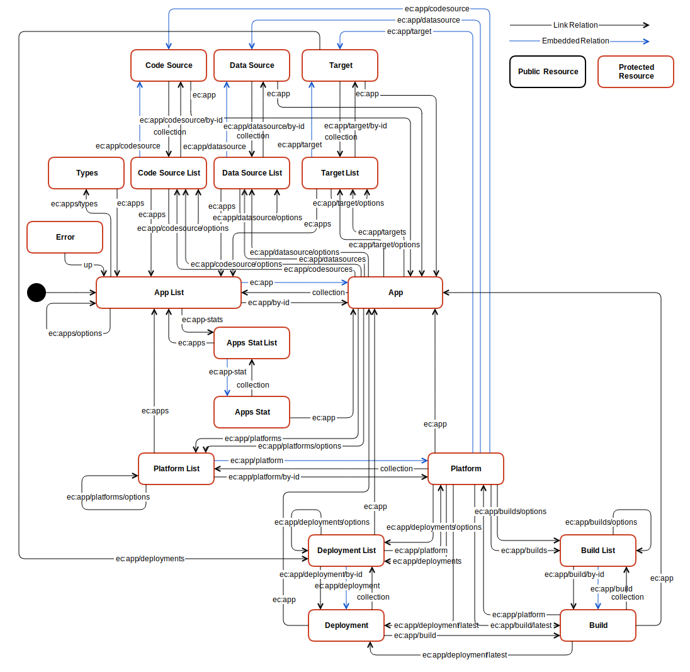

# The App Manager

The App Manager is a technical tool for configuring, building and deploying Apps. An App can have multiple platforms to run on. 

# Workflow

An [App](resources/app/) is a single, isolated entity. All other resources are dependent on a single App – they cannot be shared between Apps. 

An App can have a arbitrary number of [Platforms](resources/platform/). A Platform is a special configuration for building the App. It consists of exactly one [CodeSource](resources/codesource/), exactly one [DataSource](resources/datasource/) and at least one (but possible more) [Targets](resources/target/). Dependent on its type, the platform will build a specialized product when a [Deployment](resources/deployment/) is created.

Available CodeSource Types, DataSource Types, Target Types and Platform Types can be obtained by getting the [Types](resources/apptypes/) resource. There may be dependencies: a type may require an explicit platform (e.g. the TargetType 'App Store' could only work with the PlatformType 'iOS').

When creating a [Deployment](resources/deployment/) for a [Platforms](resources/platform/), the App Server will obtain Code from the [CodeSource](resources/codesource/), Data from the [DataSource](resources/datasource/), then build it according to the [Platforms](resources/platform/) and finally publish it to all configured [Targets](resources/target/) of the Platform.

A [Deployment](resources/deployment/) is either running, failed or successfully finished.

# App Manager API 

* **Entry Point:** [https://appserver.entrecode.de/](https://appserver.entrecode.de/)
* **[Richardson](http://martinfowler.com/articles/richardsonMaturityModel.html) Maturity Level:** 3 (full Hypermedia)
* **Media Type:** `application/hal+json` ([HAL](https://tools.ietf.org/html/draft-kelly-json-hal-06))
* **Root Resource:** `ec:apps` [(App List)](resources/app/#list)
* **Authentication:** Bearer Token aquired using the [Account Server API](account_server/#authentication)

Make sure to read [entrecode API Basics](../) first.

# State Diagram

# Link Relations

Link Relation names are those registered with the [IANA](http://www.iana.org/assignments/link-relations/link-relations.xhtml). Additionally, custom link relations are used which are built in the form `https://doc.entrecode.de/en/latest/App_Manager/#link-relations/<relation>`. Those relations are also links to their own documentation (on this page). 
For brevity, [CURIE Syntax](http://www.w3.org/TR/curie/) is used which results in relation names of the form `ec:<relation>/<optional_subrelation>`. 

Additional to the official link relations defined by [IANA](http://www.iana.org/assignments/link-relations/link-relations.xhtml) the App Manager uses the following:

| Link Relation             | Target Resource                               | Description |
|---------------------------|-----------------------------------------------------------|-------------|
| `ec:app`                    | [App](resources/app/)                          | A single App|
| `ec:app/by-id`              | [App](resources/app/)                          | Templated Link Relation to a specific App by `appID` |
| `ec:app/codesource`         | [CodeSource](resources/codesource/)            | The configured CodeSource of a Platform |
| `ec:app/codesources`        | [CodeSource List](resources/codesource/#list)  | CodeSources configured in an App |
| `ec:app/datasource`         | [DataSource](resources/datasource/)            | The configured DataSource of a Platform |
| `ec:app/datasources`        | [DataSource List](resources/datasource/#list)  | DataSources configured in an App |
| `ec:app/deployment`         | [Deployment](resources/deployment/)            | A single Deployment of a Platform |
| `ec:app/deployment/latest`  | [Deployment](resources/deployment/)            | The latest Deployment of a Platform |
| `ec:app/deployments`        | [Deployment List](resources/deployment/#list)  | All Deployments of a Platform. Also used to create a new Deployment |
| `ec:app/platform`           | [Platform](resources/platform/)                | A single Platform |
| `ec:app/platform/by-id`     | [Platform](resources/platform/)                | Templated Link Relation to a specific Platform by `platformID` |
| `ec:app/platforms/options`  | [Platform List](resources/platform/#list)      | Filter Options of the Platform List |
| `ec:app/platforms`          | [Platform List](resources/platform/#list)      | A list of Platforms of an App |
| `ec:app/target`             | [Target](resources/target/)                    | A configured Target of a Platform |
| `ec:app/targets`            | [Target List](resources/target/#list)          | Targets configured in an App |
| `ec:apps`                   | [App List](resources/app/#list)                | List of Apps |
| `ec:apps/options`           | [App List](resources/app/#list)                | Filter Options of the App List |
| `ec:apps/types`             | [App Manager Type Info](resources/apptypes/)      | Information about available CodeSource-, DataSource-, Target- and Platform-Types |
