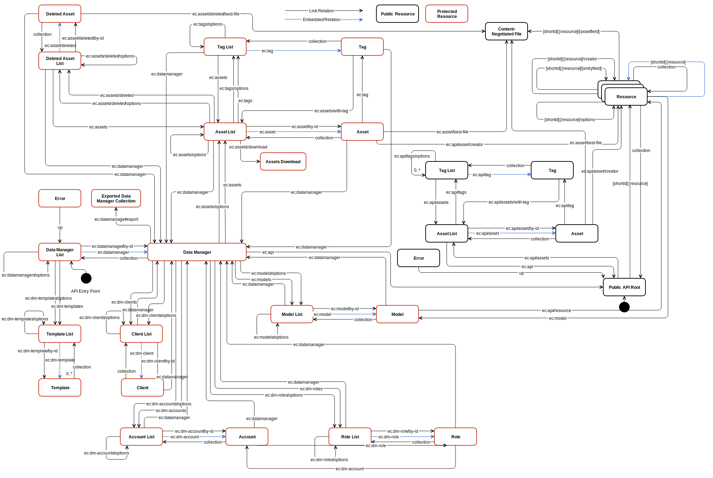

# The Data Manager

The Data Manager is a technical tool for dynamic generation of Hypermedia REST APIs – complete with documentation, JSON schemas, and goodies like static file management and external Hooks. 

# Workflow

A [Data Manager](resources/datamanager/) is a single, isolated entity. All other resources are dependent on a single Data Manager – they cannot be shared between Data Managers. 

Resource Media Types (“Templates”) are called [Models](resources/model/). They define a structure for resources, consisting of different [fields](#field-data-types) – similar to Database tables. 

[Assets](resources/asset/) are wrappers for static files. They can be organized using [Tags](resources/tag/) and can contain multiple variants of a file (e.g. multiple image sizes or different localizations). 

After defining models for a Data Manager, a Hypermedia REST API is automatically generated and deployed to the cloud – including [user management](#user-management).

External APIs can be connected using [Hooks](#hooks).

# Data Manager API

* **Entry Point:** [https://datamanager.entrecode.de/](https://datamanager.entrecode.de/)
* **[Richardson](http://martinfowler.com/articles/richardsonMaturityModel.html) Maturity Level:** 3 (full Hypermedia)
* **Media Type:** `application/hal+json` ([HAL](https://tools.ietf.org/html/draft-kelly-json-hal-06))
* **Root Resource:** `ec:datamanagers` [(Data Manager List)](resources/datamanager/#list)
* **Authentication:** Bearer Token aquired using the [Account Server API](account_server/#authentication)

Make sure to read [entrecode API Basics](../) first.

# State Diagram

[](img/statediagram-dm.svg)

# Link Relations

Link Relation names are those registered with the [IANA](http://www.iana.org/assignments/link-relations/link-relations.xhtml). Additionally, custom link relations are used which are built in the form `https://doc.entrecode.de/en/latest/App_Manager/#link-relations/<relation>`. Those relations are also links to their own documentation (on this page). 
For brevity, [CURIE Syntax](http://www.w3.org/TR/curie/) is used which results in relation names of the form `ec:<relation>/<optional_subrelation>`. 

Additional to the official link relations defined by [IANA](http://www.iana.org/assignments/link-relations/link-relations.xhtml) the Data Manager uses the following:


| Link Relation             | Target Resource                               | Description |
|---------------------------|-----------------------------------------------------------|-------------|
| `ec:api`  <a name="relation-api"></a>                  | Generated API     | Links to the generated API. |
| `ec:asset`  <a name="relation-asset"></a>                  | [Asset](resources/asset/)                          | A single Asset|
| `ec:asset/best-file`  <a name="relation-asset/best-file"></a>       | File Subresource  | The content-negotiated “best suited” file |
| `ec:asset/by-id`  <a name="relation-asset/by-id"></a>        | [Asset](resources/asset/)           | A single Asset by `assetID`|
| `ec:asset/deleted`  <a name="relation-asset/deleted"></a>     | [Deleted Asset](resources/asset/) | An Asset in the trash |
| `ec:asset/deleted/by-id`  <a name="relation-asset/deleted/by-id"></a> | [Deleted Asset](resources/asset/) | An Asset in the trash by `assetID` |
| `ec:asset/deleted/best-file`  <a name="relation-asset/best-file"></a>       | File Subresource  | The content-negotiated “best suited” file for a deleted asset|
| `ec:asset/file`  <a name="relation-asset/file"></a>| File Subresource | A file of an Asset |
| `ec:assets`  <a name="relation-assets"></a>                   | [Asset List](resources/asset/#list) | List of Assets|
| `ec:assets/deleted`  <a name="relation-assets/deleted"></a>     | [Deleted Assets List](resources/asset/#list) | Assets in the trash |
| `ec:assets/deleted/options`  <a name="relation-assets/deleted/options"></a>|[Deleted Assets List](resources/asset/#list) | Assets in the trash, filtered |
| `ec:assets/options`  <a name="relation-assets/options"></a>          | [Asset List](resources/asset/#list) | List of Assets, filtered|
| `ec:assets/download` <a name="relation-assets/download"></a> | [Asset List](resources/asset/#list) | Downloads all Assets of the list in a single Zip-File
| `ec:assets/with-tag`  <a name="relation-assets/with-tag"></a>      | [Asset List](resources/asset/#list) | List of Assets with a specific `tag`|
| `ec:datamanager`  <a name="relation-datamanager"></a>          | [Data Manager](resources/datamanager/) | A single Data Manager |
| `ec:datamanager/by-id`  <a name="relation-datamanager/by-id"></a>|[Data Manager](resources/datamanager/) | A single Data Manager by `dataManagerID`|
| `ec:datamanager/export`  <a name="relation-datamanager/export"></a>|[Data Manager](resources/datamanager/) | Postman Collection export of a single Data Manager |
| `ec:datamanager/update-from-template`  <a name="relation-datamanager/update-from-template"></a>|[Data Manager](resources/datamanager/) | (only PUT) Try to update Data Manager to template |
| `ec:datamanagers`  <a name="relation-datamanagers"></a>         | [Data Managers](resources/datamanager/#list) | List of Data Managers |
| `ec:datamanagers/options`  <a name="relation-datamanagers/options"></a>|[Data Managers](resources/datamanager/#list)| List of Data Managers, filtered |
| `ec:datamanagers/new-from-template` <a name="relation-datamanagers/new-from-template"></a>| [Data Managers](resources/datamanager/#list) | (only POST) Create a new Data Manager from Template |
| `ec:dm-account`  <a name="relation-dm-account"></a>          | [Data Manager Account](resources/dm-account/) | A single Data Manager Account|
| `ec:dm-account/by-id`  <a name="relation-dm-account/by-id"></a>|[Data Manager Account](resources/dm-account/) | A single Data Manager Account by `accountID`|
| `ec:dm-accounts`  <a name="relation-dm-accounts"></a>         | [Data Manager Accounts](resources/dm-account/#list) | List of Data Manager Accounts |
| `ec:dm-accounts/options`  <a name="relation-dm-accounts/options"></a>|[Data Manager Accounts](resources/dm-account/#list)| List of Data Manager Accounts, filtered |
| `ec:dm-client`  <a name="relation-dm-client"></a>          | [Data Manager Client](resources/dm-client/) | A single Data Manager Client|
| `ec:dm-client/by-id`  <a name="relation-dm-client/by-id"></a>|[Data Manager Client](resources/dm-client/) | A single Data Manager Client by `clientID`|
| `ec:dm-clients`  <a name="relation-dm-clients"></a>         | [Data Manager Clients](resources/dm-client/#list) | List of Data Manager Clients |
| `ec:dm-clients/options`  <a name="relation-dm-clients/options"></a>|[Data Manager Clients](resources/dm-client/#list)| List of Data Manager Clients, filtered |
| `ec:dm-role`  <a name="relation-dm-role"></a>          | [Data Manager Role](resources/dm-role/) | A single Data Manager Role|
| `ec:dm-role/by-id`  <a name="relation-dm-role/by-id"></a>|[Data Manager Role](resources/dm-role/) | A single Data Manager Role by `roleID`|
| `ec:dm-roles`  <a name="relation-dm-roles"></a>         | [Data Manager Roles](resources/dm-role/#list) | List of Data Manager Roles |
| `ec:dm-roles/options`  <a name="relation-dm-roles/options"></a>|[Data Manager Roles](resources/dm-role/#list)| List of Data Manager Roles, filtered |
| `ec:dm-template`  <a name="relation-dm-template"></a>          | [Data Manager Template](resources/dm-template/) | A single Data Manager template|
| `ec:dm-template/by-id`  <a name="relation-dm-template/by-id"></a>|[Data Manager Template](resources/dm-template/) | A single Data Manager template by `templateID`|
| `ec:dm-templates`  <a name="relation-dm-templates"></a>         | [Data Manager Templates](resources/dm-template/#list) | List of Data Manager templates |
| `ec:dm-templates/options`  <a name="relation-dm-templates/options"></a>|[Data Manager Templates](resources/dm-template/#list)| List of Data Manager templates, filtered |
| `ec:model`  <a name="relation-model"></a>                | [Model](resources/model/)         | A single Model|
| `ec:model/purge`  <a name="relation-model/purge"></a>                | [Model](resources/model/)         | Deletes all entries of the Model|
| `ec:model/by-id`  <a name="relation-model/by-id"></a>         | [Model](resources/model/)         | A single Model by `modelID`|
| `ec:model/purge/by-id`  <a name="relation-model/purge"></a>                | [Model](resources/model/)         | Deletes all entries of the single Model by `modelID`|
| `ec:models`  <a name="relation-models"></a>               | [Model List](resources/model/#list) | List of Models |
| `ec:models/options`  <a name="relation-models/options"></a>  | [Model List](resources/model/#list) | List of Models, filtered |
| `ec:tag`  <a name="relation-tag"></a>                 | [Tag](resources/tag/) | A single Asset Tag |
| `ec:tags`  <a name="relation-tags"></a>                | [Tag List](resources/tag/#list) | List of Asset Tags |
| `ec:tags/options`  <a name="relation-tags/options"></a>     | [Tag List](resources/tag/#list) | List of Asset Tags, filtered |


# Field data types

A field definition consists of the following properties:

| Key           | Value          | Examples     | Allowed change with entries  |
|---------------|----------------|--------------|-----------------|
|title          |Identifier of the field |`description`, `recipeIngredients`|This results in the removal of the old field and creates a new field with the given title (Only allowed if required is `false`).|
|description    |Additional information about the purpose of this field for documentation. | `Lists ingredients of the recipe.` | Every change. |
|type           |The field type, a value as specified below  |`text`, `boolean`, `url`, `asset`| only formattedText <> text|
|readOnly       |Specifies if the field can be written with updates (or only at creation) | `true`, `false` |Every change.|
|required       |Specifies if the field always needs a value or can also be null | `true`, `false` | Only change to `false`. |
|unique         |Specifies if the value needs to be unique | `true`, `false` |Only change to `false`.|
|localizable    |Specifies if the field is localizable | `true`, `false` | Every change. Existing entries will have localized/unlocalized values.|
|mutable        |Specifies if the field is mutable by the Data manager user, or provided by the system. | `true`, `false` | None, since this value is set by the system.|
|validation     |Validation of field values. Can be a Regular Expression (`text` type), a JSON Schema (`object` type), a model or asset type, or an object with optional `min` and  `max` values (`number` and `decimal` types), depending on `type` (specified below) | `^\d{3}\w+$`, `{ "$ref": "#some-schema" }`, `{ "min": 0, "max": 100 }`| Only removed.|

If a model has no entries all properties can be changed if the field itself is marked `mutable`. But only some properties can be changed once a model has entries, as listed in the table above.

Note that the Data Manager Field data type is published in the generated API as part of the generated JSON schema: the `title` property, which has only descriptive semantics, holds the type (useful for generating forms).

## Change model/field definition
If a model has no entries **all** properties and fields can be changed if the field itself is marked `mutable`. But only some properties and fields can be changed once a model has entries.

#### Properties
In the following table is specified if and how a property can be changed once it has entries:

| property    | change          |
|-------------|-----------------|
| title       | no change       |
| description | always          |
| titleField  | always          |
| policies    | always          |
| fields      | see table below |
| locales     | always          |


#### Fields

In the following table is specified if and how a field can be changed once it has entries:

|               | text | formattedText | decimal | number | boolean | datetime | location | email | url | phone | json | entry | entries | asset | assets | account | role |
|---------------|------|---------------|---------|--------|---------|----------|----------|-------|-----|-------|------|-------|---------|-------|--------|---------|------|
| text          |      | x             | *       | *      | *       | *        | *        | *     | *   | *     | *    | *     | *       | *     | *      | -       | -    |
| formattedText | x    |               | *       | *      | *       | *        | *        | *     | *   | *     | *    | *     | *       | *     | *      | -       | -    |
| decimal       | x    | x             |         | o      | *       | o        | -        | -     | -   | -     | -    | -     | -       | -     | -      | -       | -    |
| number        | x    | x             | x       |        | *       | x        | -        | -     | -   | -     | -    | -     | -       | -     | -      | -       | -    |
| boolean       | x    | x             | *       | *      |         | -        | -        | -     | -   | -     | -    | -     | -       | -     | -      | -       | -    |
| datetime      | x    | x             | o       | o      | -       |          | -        | -     | -   | -     | -    | -     | -       | -     | -      | -       | -    |
| location      | x    | x             | -       | -      | -       | -        |          | -     | -   | -     | x    | -     | -       | -     | -      | -       | -    |
| email         | x    | x             | -       | -      | -       | -        | -        |       | -   | -     | -    | -     | -       | -     | -      | -       | -    |
| url           | x    | x             | -       | -      | -       | -        | -        | -     |     | -     | -    | -     | -       | -     | -      | -       | -    |
| phone         | x    | x             | -       | -      | -       | -        | -        | -     | -   |       | -    | -     | -       | -     | -      | -       | -    |
| json          | x    | x             | -       | -      | -       | -        | *        | -     | -   | -     |      | -     | *       | -     | *      | -       | -    |
| entry         | x    | x             | -       | -      | -       | -        | -        | -     | -   | -     | -    |       | x       | -     | -      | -       | -    |
| entries       | x    | x             | -       | -      | -       | -        | -        | -     | -   | -     | -    | o     |         | -     | -      | -       | -    |
| asset         | x    | x             | -       | -      | -       | -        | -        | -     | -   | -     | -    | -     | -       |       | x      | -       | -    |
| assets        | x    | x             | -       | -      | -       | -        | -        | -     | -   | -     | -    | -     | -       | o     |        | -       | -    |
| account       | -    | -             | -       | -      | -       | -        | -        | -     | -   | -     | -    | -     | -       | -     | -      |         | -    |
| role          | -    | -             | -       | -      | -       | -        | -        | -     | -   | -     | -    | -     | -       | -     | -      | -       |      |
**Icon Description:** x = OK, o = with data loss, * = with migration, - = not possible, rows are source fields, columns are target fields

## Mandatory fields
Those fields are mandatory and included in all models by default. They cannot be deleted or otherwise modified (mutable = `false`).

### id (Type: `id`)
The `id` field is a unique identification for an entry and an own, non-reusable type.

### created (Type: `datetime`)
The timestamp of the creation of an entry. All date and time values are UTC in [RFC3339](https://tools.ietf.org/html/rfc3339) format.

### modified (Type: `datetime`)
The timestamp of the last modification of an entry. All date and time values are UTC in [RFC3339](https://tools.ietf.org/html/rfc3339) format.

### creator (Type: `account`)
The user account that created this entry. If the entry was created by an ec.user or without authentication, the value is `null`

## Allowed field names

A field title may consist of up to 256 characters, but is limited to lowercase- and uppercase characters, digits, _ and -.
Field titles *should* only use lowercase characters and be singular (e.g. `article` instead of `articles`).
The following field names are reserved, since they are used internally by the system.

* id
* created
* modified
* creator
* page
* size
* sort
* private
* ending with "from"
* ending with "to"
* ending with "~"
* starting with "_"

## Types

### Primitive Types
These types are simple data types.

|Type|Description|Entry<br/>Structure|Validation|Sort-<br/>able|Filterable|Example|
|----|-----------|---------------|----------|--------|----------|-------|
|`text`|A simple string value of any length. For common formats, better use [Convenience Types](#convenience-types).|String|Regular Expression|yes|exact, search, multiple|`"foo"`|
|`formattedText`|Same as `text` type, but for formatted text.|String|Regular Expression|yes|exact, search, multiple|`"foo"`|
|`number`|A signed integer number. Keep integer limits in mind.|Number|Object with `min` and/or `max` values|yes|exact, range, multiple|`7`|
|`decimal`|A floating point number. Keep precision limits in mind.|Number|Object with `min` and/or `max` values|yes|exact, range, multiple|`4.2`|
|`boolean`|A simple true/false flag.|Boolean|—|no|exact|`true`|

### Convenience Types
These types are more complex types with a specific domain that abstract from primitive types.

|Type|Description|Entry<br/>Structure|Validation|Sort-<br/>able|Filterable|Example|
|----|-----------|---------------|----------|--------|----------|-------|
|`id`  |Unique identification for an entry. This is an own, non-resuable type.|String|—|no|exact, multiple|`"j4kd68fz"`|
|`datetime`|A date and/or time data type in [RFC3339](https://tools.ietf.org/html/rfc3339) format (always including Time Zone).|Date|—|yes|exact, range, multiple|`"2015-01-14T13:33:43.168Z"`|
|`location`|A latitude/longitude definition of a location. Uses the JSON schema [http://json-schema.org/geo](http://json-schema.org/geo)|JSON Object with keys `latitude` and `longitude`|—|no|exact, range <br/>(with values `lat,long`)|`{latitude: 48.774702,`<br/>`longitude: 9.1827263}`|
|`email`|A valid eMail address. Internally, [validator.js](https://github.com/chriso/validator.js) is used.|String|—|yes|exact, search, multiple|`"info@domain.com"`|
|`url`|A valid URL. Internally, [validator.js](https://github.com/chriso/validator.js) is used.|String|—|yes|exact, search, multiple|`"http://entrecode.de"`|
|`phone`|A valid Phone number according to [E.164](http://www.itu.int/rec/T-REC-E.164/en). Will automatically formatted in international format according to the default locale of the current Data Manager with [libphonenumber](https://github.com/googlei18n/libphonenumber) |String|—|yes|exact, search, multiple|`"+49711832468234"`|
|`json`|A generic JSON object. |JSON Object or Array|A valid [JSON Schema](https://tools.ietf.org/html/draft-kelly-json-hal-06)|no|—|`{key: "value"}`|


### Linked Types
|Type|Description|Entry<br/>Structure|Validation|Sort-<br/>able|Filterable|Example|
|----|-----------|---------------|----------|--------|----------|-------|
|`entry`|Link to a single entry that is related to this one.|String (`entry.id`)|A model to enforce a specific entry type|—|exact, multiple|`"49a8f3b4"`|
|`entries`|Link to entries that are related to this one.|Array<br/>(of `entry.id` Strings)|A model to enforce a specific entry type|—|search<br/>(single id that is included), multiple|`["8fa398d2","49a8f3b4"]`|
|`asset`|Link to a single asset that is related to this entry.|String (`asset.assetID`)|An asset type to enforce a specific type|—|exact, multiple|`"a8c44bd8-d225-433b-94e4-20fd38ea2d8f"`|
|`assets`|Link to assets that are related to this one.|Array<br/>(of `asset.assetID` Strings)|An asset type to enforce a specific type|—|search<br/>(single id that is included), multiple|`["371393a6-ab7f-4591-8d5d-54261a52d28b",`<br/>`"a8c44bd8-d225-433b-94e4-20fd38ea2d8f"]`|
|`account`|Link to an account.|UUID (v4)|–|—|exact, multiple|`"371393a6-ab7f-4591-8d5d-54261a52d28b"`|
|`role`|Link to a role.|UUID (v4)|String (role label)|—|exact, multiple|`"a118f6a0-0d74-463d-b1d7-afcf3eb6da3a"`|


# Assets in the Generated API (aka. getBestFile)
Assets have a file-independent URL (consisting of the asset ID). Calling it returns the best fitting file, depending on the requested Locale (Accept-Language header).
Image resources also support requesting a specific size: The query string parameter `size` can be used to specify the size in pixels the largest edge should have at least. Note that if the image is smaller than that, the largest possible image is returned (but possibly smaller than `size`). To request thumbnail sizes (thumbnails are square-cropped images of size 50, 100, 200, 400px), send the parameter `thumb` with the request. If you do not want the file directly you cann add `/url` to the request and you will get a JSON with a field `url` containing the url of the file you would have received.

Examples:

```
https:/datamanager.entrecode.de/files/:assetID/:url?{?size,thumb}
```
general description of the best file route.

```
https:/datamanager.entrecode.de/files/853a931b-2091-4f92-acad-cd0c0e6fedbc?size=100&thumb
```

will get the thumbnail `file` for the asset with `size` 100.

```
https:/datamanager.entrecode.de/files/853a931b-2091-4f92-acad-cd0c0e6fedbc/url?size=100
```

will get the `url` for the asset with `size` 100.


Additionally there is a API for public assets similar to the `ec:asset[s]`. Please refer to the public documentation found in any data manager in editor.

#### Custom Asset Domain
It is possible to use a custom asset domain. In order to geht this working simply edit the `config` of a Data Manager to include the property `customAssetDomain`. Set the value to the custom domain. After configuring the Data Manager you'll need to set up your Domain to proxy the requests to the original url of the file (original links will always work).

###### Example:

```
Original URL:
https://cdn2.entrecode.de/beefbeef/QwB6QDJ5V9jrLkEd6OdBvXqh.jpg

Custom Domain:
https://www.example.com/static/QwB6QDJ5V9jrLkEd6OdBvXqh.jpg
```

Your proxy should redirect all `https://www.example.com/static/(.*)` requests to `https://cdn2.entrecode.de/beefbeef/$1`. We do this by configuring a AWS CloudFront to serve `/static/` requests from the same origin as our `cnd2.entrecode.de` does but with `beefbeef` as root path.


# User Management

While Data Manager owners (users with an entrecode Account) can generally do anything, the generated APIs have their own User Management. It knows three types of users: *Public*, which is everybody without any authentication (Web Users). *Anonymous* which are users that are created by software, but that never actively registered – useful to have users store their own data in an app without requiring an registration. And finally *Registered* which are users that have actively signed up, providing an email address and at least one login method.

Anonymous users have one access token that is valid indefinitely or until they sign up and become a registered user. Login and Signup can be done using a registered [Data Manager Client](resources/dm-client/).

To get an anonymous user, POST to the `<dataManagerShortID>:_auth/anonymous` relation. Optional query parameter can be set to adjust the token validity time. It returns an object containing the long-lived `jwt`, as well as an `accountID` and information about the token validity time.

Which user levels are available can be configured for a data manager. 

While Anonymous and Registered users automatically get added to default user roles, one can also create additional roles and assign users to those roles.

Roles can be used in Permission Policies.

# Permission Policies

There are four possible methods to interact with entries of a model: create (POST), read (GET), update (PUT) and delete (DELETE). By default, none of those methods is permitted (the data manager user can still do everything, however).

Interaction can be permitted using Policies that are specified on the model level. Every model can have any number of policies.

A **Policy** consists of the following properties:

- **Which Method** does the policy allow? (one of `get`, `put`, `post`, `delete`) 
- does it consider the whole entry or is it **restricted to some fields?** E.g. only allow reading of two specific entry fields.
- **Who** is getting the permission? Can be either `public`, or one or multiple `roles`
- Additional **Conditions** the entry has to fulfill

Example:

    {
        "method": "get",
        "restrictToFields": [ "title", "description"],
        "public": false,
        "roles": ["registered"]
    }
    
*Only registered users can read entries of this model, and only the `title` and `description` property.*

**Conditions** restrict the policy to a subset of entries that fulfill the conditions. They can be nested and are pretty much logical boolean expressions.

A **Condition** can either be

- an Array containing three elements: a condition, `and` or `or`, and another condition

or 

- an Object with the properties `field`, `operator` and either `constant` or `variable`.

The property `field` must be the field name of a field of the model. May also be a system-generated field like `_creator`.

The property `operator` can be `=`, `!=`, `<`, `<=`, `>`, `>=`, `in`, `notIn`, `hasRole` and `hasNotRole`.

The property `constant` can be a JavaScript literal, like a string, a number or `null`. When used with the `in` operator, it can also be an Array containing literals.

The property `variable` can either be `accountID` or `roles` for fields of type `account`, or `now` for fields of type `datetime`.

Some combinations are not valid. E.g. `<`/`>` only makes sense on numerical fields. The `hasRole` operator only works on `account` type fields and either expects one or more roles as `constant` or the variable `roles` (containing all roles the current user has). `null notIn [Array]` is always false, even if `null` is in the Array – only Arrays with actual values are considered.
It is not possible to have conditions on policies for the `post` method, and it is also not possible to have `restrictToFields` populated on policies for the `delete` method.

Note that when someone has policies for `put` or `post`, they probably also should have a `get` policy. Otherwise created or modified entries will not be returned, instead a HTTP 204 will be returned without a body. And yes, it is possible to model policies that allow editing of a field that cannot be seen.

Example 1:

    {
        "method": "put",
        "restrictToFields": ["editableField"],
        "public": false,
        "roles": ["anonymous"],
        "conditions": [
            {
                "field": "_creator",
                "operator": "=",
                "variable": "accountID"
            },
            "or",
            {
                "field": "public",
                "operator": "="
                "constant": true
            }
        ]
    }

*Only anonymous users can update the field `editableField` on entries they created or that have the value `true` in the field `public`. Note that the `public` field has to be created manually, if needed.*

Example 2:

    {
        "method": "post",
        "restrictToFields": ["data"],
        "public": false,
        "roles": ["freeUsers"]
    },
    {
        "method": "post",
        "restrictRuleToFields": ["data", "hideAds"],
        "public": false,
        "roles": ["paidUsers"]
    }
    
*Accounts with the role `freeUsers` can only create entries with the `data` field, whereas accounts with the role `paidUsers` can also set `hideAds`. Unallowed fields get their default value (probably `null` or `false`)*

# Customization of User Authentication

By default, "Auth" (meaning: Signup, Login, eMail-Change, Password-Reset) is done using ec.passport with dynamically generated, but generic looking templates. This means that the eMails your users receive and the rendered HTML Forms they'll see in the process are labeled with the name of your Data Manager, but have a very generic look. If you're building a Web App, you probably want to style those forms yourself and maybe even want to send mails in a custom format.

## Custom eMails

You are required to register a (sub-)domain for sending custom eMails. You can still use the domain in your own eMail provider, but it is needed to be registered with entrecode in a manual process including adding some DNS entries for validation of domain ownership. If you do that, not only will auth-related mails be sent from your-data-manager-name-noreply@your-domain.com, but you will also able to use that domain for Mail Hooks! Domains are not restricted to a single Data Manager.

When a domain is registered for your Data Manager, you are eligible to provide mail templates. They are required to support [Handlebars.js](http://handlebarsjs.com) as template engine and should include certain variables (e.g. for the links the user can click). To make the templates available for your domain, a manual process at entrecode is necessary. Mail templates may also be delivered in multiple languages. We recommend [Mailgun Transactional Mail Templates](http://blog.mailgun.com/transactional-html-email-templates/) as a starting point for your own mail templates.

The domain has to be set in your Data Manager configuration as `config.customAuthDomain`.

| template name      | purpose | data variables |
|--------------------|---------|-----------|
| email-verification | Sent after signup to verify a user's mail address             | `link`, `email`, `title` (the Data Manager Title) |
| change-email       | Sent to a new mail address after a change for verification    | `link`, `email`, `title` (the Data Manager Title) |
| change-email-abort | Sent to the old mail address after a change for resetting it  | `link`, `email`, `newMail`, `title` (the Data Manager Title) |
| password-reset     | Sent to the user if a new password is requested               | `resetLink`, `abortLink`, `email`, `newMail`, `title` (the Data Manager Title) |

All templates receive the variables `to`, `from`, `subject`, `template` and `language`, as well as `data` which has custom properties listed in the table above.

## Custom Auth HTML pages

When clicking on a link in one of the auth mails, or after requesting an email change, by default a HTML page is rendered.
You can customize those pages inside your Web App and make the calls to your Data Manager API manually using XHR. For that to work, you have to send your calls to Data Manager with the query string `?rest=true` appended, which results in JSON responses instead of finished HTML pages.
Your also need to configure your own endpoints to use in the links sent in the eMails. Add the following to your Data Manager config as `config.customAuthLinks`:

```js
"customAuthLinks": {
  "email-verify": "https://your-domain/email-verification{?jwt}",
  "password-reset-abort": "https://your-domain/password-reset/abort{?jwt}",
  "password-reset": "https://your-domain/password-reset{?jwt}",
  "change-email-abort": "https://your-domain/change-email/abort{?jwt}",
  "change-email-verify": "https://your-domain/change-email{?jwt}"
}
```

You are free to define those URLs as you like, but they need to be valid [Template URIs according to RFC 6570](https://tools.ietf.org/html/rfc6570) expecting a variable `jwt`. This token you'll need to make the actual auth requests to your Data Manager API.

They map like this (all relative to your API root):

* `email-verify`: `/_auth/email-verification/{jwt}?rest=true`
* `password-reset-abort`: `/_auth/password-reset/abort/{jwt}?rest=true`
* `password-reset`: `/_auth/password-reset/{jwt}?rest=true`
* `change-email-abort`: `/_auth/email-verification/abort/{jwt}?rest=true`
* `change-email-verify`: `/_auth/email-verification/{jwt}?rest=true`

Note: the `password-reset` route is only for validating the JWT, that it is still valid to set a new password. If you don't customize it, it will render a form to change the password. It is recommended to use the route after the user opened the link in the password reset mail to check if the request is valid. Then render a form requesting a new password. The new password has then to be sent in a POST request to `/_auth/password-reset/callback/{jwt}?rest=true` as JSON key `password`.

To request an email change, POST a JSON with key `email` to `/_auth/change-email?rest=true` to receive JSON response instead of a rendered HTML.

The JSON responses triggered using `?rest=true` contain an object with all necessary data for rendering an HTML page, or an error. 

# Hooks
Hooks can be used to add additional functionality to models. E.g. they enable you to alter values before saving or to pass data on to another server.

A hook is always enabled on a per-model basis and can be triggered either before or after processing the request. A before-hook is able to transform the request (and e.g. alter values before saving them). An after-hook can be used to for example communicate the creation of an entry to another server. Hooks can be set up for all four standard HTTP methods (GET, PUT, POST, DELETE).

Hooks are defined in the `hooks` property of a model. It is always a JSON Array. There can be an arbitrary number of hooks for a model. If two hooks are configured for the same trigger point (e.g. 'before put'), they are triggered in the order they are listed in the `hooks` array.

There are different types of hooks that each have their own necessary configuration.
Hooks are normally asynchronous. This means, the normal Data Manager execution is not influenced by the hook and not delayed. If a hook throws an error (e.g. a remote web server could not be reached), this does not influence the data manager request. However, “before” hooks can optionally be synchronous. This enables transformation of requests.

Example JSON:

```js
[
    {
        "hook": "after", // 'before' or 'after'
        "type": "web", // a valid type
        "methods": ["post"], // 'get', 'put', 'post' or 'delete'
        "description": "my test hook" // optional. Makes the hook identifiable in logs etc.
        "config": {
            // type specific
        },
        "hookID": "a0603b90-ee1e-49ce-8201-aa6e06124e2f" // identifier for simpler sorting of multiple hooks. May change.
    },
    {
    // another hook. If it has the same signature ('after' 'post'), it will be executed after the first one.
    }
]
```

## Web Hook
The web hook sends data to another server via HTTP/HTTPS.

Multiple targets can be set, so it is possible to notify multiple servers. Each target can be configured with an URI, the HTTP method to use and optional custom header fields.


### Web hook configuration

The available data to use in Web hooks is the following JSON object containing all available information about the request:

```js
{
    "request": {
        "method": "put",
        "uri": "https://datamanager.entrecode.de/beef1337/mymodel?myfield=filtered",
        "body": {
            "myfield": "newValue"
        },
        "headers": {
            "my-custom-header": "my custom header value"
        }
    },
    "response": { // the response property is only available if it is an 'after' hook.
        "status": 200,
        "body": {
            "count": 1,
            "total": 1,
            "_links": {
                // ... HAL links
            },
            "_embedded": {
                "beef1337:mymodel": {
                    "id": "l231ij4",
                    "myfield":"newValue"
                    // ... full response
                }
            }
        }
    }
}
```
*The `response` property is currently not available in hooks!*

This object can be transformed to only send the required information.
See [Transformations](./#transformations) below for details.

The following example is a complete web hook configuration:

```js
[
  {
    "hook": "after", // 'before' or 'after' – when should the hook be fired?
    "type": "web", // indicates that this is a web hook
    "methods": ["put"], // which methods should this hook watch
    "description": "send updated entry", // describe what the hook does
    "config": { // this config object is web-hook-specific
      "createJWT": { // optional. Will create a JWT before syncing
        "variableToSet": "jwt", // required. The context variable that will hold the generated JWT
        "algorithm": "HS256", // required. The algorithm to use: HS256, HS384, HS512 (HMAC) or RS256, RS384, RS512 (RSA)
        "issuer": "entrecode", // optional, can be any string and can use context variables
        "secret": "GQDstcKsx0NHjPOuXOYg5MbeJ1XT0uFiwDVvVBrk", // only needed if the algorithm is HMAC (HS***)
        "subject": "{{username}}", // optional. Can use context variables
        "expiresIn": "5min" // optional. Expiration time in seconds or a timespan according to https://github.com/rauchg/ms.js
      },
      "requests": [ // you can list any number of requests here, they get executed sequentially.
        {
          "uri": "https://my-other-server/endpoint?remoteID={{response.body._embedded['beef1337:mymodel'].id}}", // you may access variables from the context here
          "headers": {
            "Authorization": "Bearer 1o32iru1oi3rj",
          },
          "method": "post"
          "body": {
            "__jsonmask": "response/body/_embedded/*(id,property1,property2)", 
            "__jsonpath": "$.response.body._embedded['beef1337:mymodel']",
            "__array": false
          },
          "responseMapping": { // maps the response to new context variables (optional)
            "accessToken": { // the value of $.body.accesstoken will be available in the next request as {{accessToken}}
              "__array": false,
              "__jsonpath": "$.body.accesstoken" // $ is the full response object, so you may also access headers
            }
          }
        },
        {
          uri": "https://my-other-server/endpoint?remoteID={{response.body._embedded['beef1337:mymodel'].id}}",
          "headers": {
            "Authorization": "Bearer {{accessToken}}", // the variable set in the previous request
          },
        }
      ]
    }
  }
]
```
It sends the `id`, `property1` and `property2` values of the edited entry to `https://my-other-server/endpoint?remoteID=l231ij4`.
A “before” web hook can also be synchronous:

```js
{
    "hook": "before",
    "type": "web",
    "methods": ["put"],
    "description": "external validation",
    "config": {
        "requests": [
            {
                "uri": "https://my-other-server/endpoint",
                "headers": {
                    "Authorization": "Bearer 1o32iru1oi3rj",
                },
                "method": "get"
                "validate": {
                  "status": 200 // you may enforce a specific http status code from the remote (only in before hooks)
                }
            }
        ],
        "responseMapping": { // the original request body will get those properties assigned additionally
            "property1": {
                "__jsonpath": "$.body.property1" // this is a property of the last request's response body
                "__array": false
            },
            "property2": "hard coded" 
        }
    }
}
```

The `validate` property (which is only effective in “before” hooks) can be configured to expect a certain HTTP status of the remote server, in this case the request is only executed if the remote server answers with HTTP status 200. If the target server(s) respond with another status code, the data manager request is rejected with an error. An optional error response of the validating server is sent back to the data manager client. 

The `responseMapping` property in the root level (not the individual requests) can be used to amend the request body with data from a foreign server. Properties can also get hardcoded values. Properties not written remain at the value provided by the original request.

## Mail Hook

*Note: there are currently two implementations available. The deprecated one sends mails directly. The favored one is event-based and supports custom Domains. The deprecated mail hook is hook type `mailgun` and should not be used anymore.*

The `mail` hook is neither a `before` nor an `after` hook, but an `event` hook instead. This means that the main data manager process does not execute this hook, but ec.event-hook service does after the desired action produced an event (same behaviour as an `after` hook). It is not possible to have a mail hook on the `get` method, because reads do not trigger an event.

```js
{
	"hook": "event",
	"type": "mail",
	"config": {
		"to": "{{data.recipient}}",
		"from": "{{data.sender}}",
		"text": {
			"__jsonpath": "$.data.content"
		},
		"subject": "{{data.subject}} ",
		"domain": "entrecode.de",
		// ... more properties, see https://documentation.mailgun.com/api-sending.html#sending
	},
	"methods": [
		"post"
	],
	"description": "Simple Mail Hook",
	"hookID": "dd53b7c2-a494-44e6-883a-4269a89022c2"
}
```

This example builds a simple mail from an entry. Note the use of [transjson](#json-transformations) functionality to build the mail dynamically.
The available properties inside `config` map 1:1 to the properties described in the [Mailgun API Documentation](https://documentation.mailgun.com/api-sending.html#sending). Multiple recipients / multiple values for the same properties can be set as array. The `domain` property can be used to send via a specific domain; if it is omitted, the default will be taken. Note that the domain has to be registered with mailgun, which is a manual process for now.

It is recommended to always include a `text` property, even when a `html` property is present.

*This is an event hook. If the hooks seems not to trigger, the issue is usually fixed by saving the model once again. (Event Hook configuration is stored in etcd, not in PostgreSQL).*


# Synchronization

A Sync configuration can be added to models to synchronize the entries with another API. The Sync is read-only – writing to remote servers is possible using Hooks. 
The remote API is required to support JSON over HTTP. It is not required to be RESTful. Remote API Resources need to have a unique ID.

Multiple subsequent HTTP requests can be done to get the required data.

Sync is defined in the `sync` property of a model. It is always a JSON Object. Only one sync setting is available for each model.

Synchronization is triggered using a special request on the generated API. It requires Authentication of an authorized ec user.

## Sync Types

There are different types of synchronization with slightly different necessary configuration:

* **Type 1: Full list sync**

    This kind of synchronization syncs with a remote API that provides a complete list of resources that map 1:1 on entries. Example: we have a model `person`, and the remote server provides a resource returning a list of all persons. A sync will create an entry for each person in the remote entry. Subsequent syncs will update changed entries (overwriting changes to the local entries) and also delete entries whose related resources on the remote API are no longer existing.

* **Type 2: Subresource sync**

    This kind of synchronization is also a full list sync, but it is done multiple times: for each entry of a parent model. The returned resources are merged into a full list of all resources. The relation to the parent model is set using an `entry` type field to the parent entry. Example: we have the above model `person` and also a model `task` with tasks for each person. The remote API only provides a list of tasks for a single person. The subresource sync is then set to obtain the task list for each entry in the `person` model (that model does not necessarily need to have a own sync configuration). The synced task entries all have an `entry` type field pointing to the related `person` entry.

* **Type 3: Single Resource sync**

    This kind of synchronization does not add new entries or delete entries of the model, but merely updates them using data from a remote API. Therefor it does a request for each entry in the model. Properties set to assume a value from the remote server will be overwritten on sync. Example: we have a local model holding user data, `users`. It is filled when a new user registers for our app. For each user we want to save the profile picture of a social network providing a REST API. Therefor we ask the user to enter his username of the social network. The sync is configured to obtain the profile picture URI for each user from the remote API.
    
## The Request sequence

As mentioned above, multiple successive HTTP requests can be done to get the remote data. It is possible to pass data from request to request. The available data is called the *context*. By default, the context will contain the old entry (for Single Resource sync) or the properties `parentID` and `parentResource` (for subresource sync); as well as the public Data Manager Config (config.publicConfig as `config`). The full list sync initially has an empty context. Each request can have a `responseMapping` property containing a [JSON Transformation](#json-transformations). The returned object's properties will be added to the context and be accessible for subsequent requests. Subsequent requests may overwrite those properties.
The context is also available when building the response mapping for the next request, in the JSONPath `$.__context`. 

## Supplying a JSON Web Token (JWT)

For authentication of the Data Manager Server against a remote API it is possible to create and sign a JSON Web Token. It can be signed using HMAC with a supplied secret or using RSA with public/private key signing.
The public key for validating generated JWTs is:

```
-----BEGIN PUBLIC KEY-----
MIGfMA0GCSqGSIb3DQEBAQUAA4GNADCBiQKBgQCFFGDQFysjXTmiA1vjWTRB9bSy
2SGOPpxMLzetgj1TlWwdzX5GdpooqAjZgJOd4fkXDFUlKKIHukiow1EqYNpxZ60w
7chYF4s40fRGx62G8Qcx7kzrtDBQfC8mVjNUHXTsaYV/AiNb2FhRd3vniYyVqD7X
pKyyITayPNKNHme3SQIDAQAB
-----END PUBLIC KEY-----
```

The jti is always a newly generated UUIDv4 for each request. Subject, issuer and expiration can optionally be set. The generated JWT is assigned to a context variable and can be used in the requests.

## Mapping `entry` fields
Fields of the type `entry` can be mapped to entries of another model that is also synced. This means, when the value of the property supplied by the sync remote is the same as the `syncID` value of an entry in another model, a link to that entry will be inserted in the entry field. 
To configure that, supply the modelID of the target model to look in. See example below.

## Sync object JSON Structure

It is included in the Model JSON Schema. 
Explanation using an Example:

```js
{
  "locale": "", // locale of all generated entries. MUST be set, but can be empty.
  "createJWT": { // optional. Will create a JWT before syncing
    "variableToSet": "jwt", // required. The context variable that will hold the generated JWT
    "algorithm": "HS256", // required. The algorithm to use: HS256, HS384, HS512 (HMAC) or RS256, RS384, RS512 (RSA)
    "issuer": "entrecode", // optional, can be any string and can use context variables
    "secret": "GQDstcKsx0NHjPOuXOYg5MbeJ1XT0uFiwDVvVBrk", // only needed if the algorithm is HMAC (HS***)
    "subject": "{{username}}", // optional. Can use context variables
    "expiresIn": "5min" // optional. Expiration time in seconds or a timespan according to https://github.com/rauchg/ms.js
  },
  "requests": [ // array of requests to perform. Needs at least one entry. 
    {
      "uri": "https://myapi/myroute", // required: the URI. Can use context variables.
      "method": "post", // HTTP method. Currently supported: get, put, post, delete. Default is get.
      "body": { // available for post and put method. Can use context variables.
        "key": "{{value}}"
      },
      "headers": { // Object to set additional headers. Can use context variables.
        "My-API-Key": "{{jwt}}"
      },
      "responseMapping": { // maps the response to new context variables (optional)
        "accessToken": { // the value of $.body.accesstoken will be available in the next request as {{accessToken}}
          "__array": false,
          "__jsonpath": "$.body.accesstoken"
        }
      }
    }
  ],
  "pathToArray": "$.body.values", // required: path to the resource list to sync (single object in Single Resource Sync)
  "remoteID": {
    "__array": false,
    "__jsonpath": "$.id", // required: path to the unique ID of the remote resource. All JSON Transformations are possible, so you may also build ids out of multiple properties
  },
  "itemMapping": { // Mapping of the final result to properties of the entry
    "name": [ 
          {
            "__array": false,
            "__jsonpath": "$.renewal", // by default, only the value of "pathToArray" of the last request is accessable. 
            "__modifier": "stringify"
          },
          {
            "__modifier": "replace",
            "__arguments": [
              "^(\\d+)$", // remember to escape Regular Expressions
              "P$1M"
            ]
          } 
    ],
    "title": { // in this example, `name` and `title` of the entries will be set.
      "__array": false,
      "__jsonpath": "$.__context.accessToken" // Previous responses can be accessed by setting a context variable and accessing $.__context.
    }
  },
  "entryRelationTargetModelIDs": {
    "country": "17d6e37f-5ab8-46d7-a2f1-a3de1832104c" // country field links to synced entry in other model. Can also be the model title instead of modelID.
  }
  "subResource": { // if this property is set, a sub resource sync (sync Type 2) is done
    "parentModelID": "461bc760-5fb1-47c9-9a81-449f7ae99afd", // required: model ID of the parent model. You can also use the modelTitle instead. However, you should then use the modelTitle everywhere, and not mix the ID notation with the title notation.
    "parentIDForRequests": "$.username", // required: this value of the parent entry will be {{parentID}} in the request context. Either "syncID" (the generated ID of a remote resource), a jsonpath, or a JSON Transformation object.
    "entryFieldForParentRelation": "parentEntry" // required: the entry field that will hold the relation to the parent resource
  },
  "singleResource": { // if this property is set (and not "subResource"), a single resource sync (sync Type 3) is done
    "resourceMapping": { // each of the here defined properties will be available in the request context
      "username": {
        "__array": false,
        "__jsonpath": "$.remoteData.username"
      }
    }
  }
}
```

# JSON Transformations

Hooks and Sync configurations on models allow for JSON transformations.

Basically, a source object gets transformed into a new JSON object using various functions.
To transform a JSON object, a transformation definition is needed which holds the basic desired JSON structure and some magic properties that trigger insertion of data from the source object.

Supported transformations are:

* static values
* a subset of the whole source JSON structure, using JSON-Mask
* certain values of the source JSON, using JSONPath
* modification of values using standard JavaScript functions
* Concatenation of multiple values

#### Static values

Values can get fixed, static values (without anything from the source object).

Example:

```js
{
  "property": "value"
}
```

just stays the same.
 

#### [JSON-Mask](https://github.com/nemtsov/json-mask) 
JSON-Mask is a notation to mask specific parts of a JSON object, hiding the rest. For example, to only pass on the request body of the [Web Hook object](./#web-hook), the following JSON mask would be used: 

`request/body`

To only pass on the request method/uri and the response status, the following JSON mask would be used:

`request(method,uri),response/status`

Full Example:

```js
{
  "__jsonmask": "request(method,uri),response/status"
}
```
This would return an object containing request with method and uri properties, as well as response with status property.

JSON-Mask does not alter the structure of the JSON, it just hides specific parts of it. This means, that the data will always have the `request`/`response` root level properties. To get rid of those, you can additionally use JSONPath:

#### [JSONPath](https://github.com/dchester/jsonpath)

JSONPath can be used to query JSON objects similar to XPath for XML. It returns an array of “matches” and works similar to CSS and JQuery selectors. To only return the actual request body, the following JSONPath expression would be used:

`$.request.body`

It also lets you get a response body without the HAL container:

`$.response.body._embedded['beef1337:mymodel']`

Arrays may even be filtered with [JSONPath syntax](https://github.com/dchester/jsonpath#jsonpath-syntax).

Full Example:

```js
{
  "__jsonpath": "$.request.body",
  "__array": true
}
```

This would return only the request body, put in an array.

Note that by default JSONPath a single object or an array. With the optional `__array` flag you can instead enforce returning always an array, even if only one object was matched.

*This was a change introduced in version 0.7.9. In previous versions, the default value for `__array` was `true`.* 

#### Modifier functions

Values (typically provided using a `__jsonpath` property) can be modified using a predefined set of functions. To use this functionality, an additional `__modifier` property with the desired function name is required. Valid function names are:

##### parseInt
Parses an Integer value out of a string (using radix 10).

##### parseFloat
Parses a Float value out of a string. Keep in mind that the `.` is used as decimal point, not comma.

##### stringify
Calls [JSON.stringify()](https://developer.mozilla.org/en/docs/Web/JavaScript/Reference/Global_Objects/JSON/stringify) on the value, returning a string value. Note that calling JSON.stringify on Strings double-escapes the string.

##### replace
Calls [String.replace()](https://developer.mozilla.org/en-US/docs/Web/JavaScript/Reference/Global_Objects/String/replace) on the value. 
It is required to provide an additional property `__arguments` containing a two-element array with the search string or regular expression as first element, and the replacement as second element.
Important: because of the JSON structure, Regular Expressions have to be supplied as strings. This means that special JSON characters (like `\`) inside Regular Expressions need to be escaped. Basically, things like `\d` have to be sent as `\\d` to work.

##### uppercase
Make all characters uppercase characters

##### lowercase
Make all characters lowercase characters

##### date
Converts a value into a Date. If no value is given (e.g. using `__jsonpath`), the current timestamp is the value. String values are transformed into a date using [Moment.js String parsing](http://momentjs.com/docs/#/parsing/string/). The output value is by default an ISO 8601 String (including time zone).
Optionally, formats can be given for parsing and output formatting. 
The property `__arguments` can contain a two-element array (both values optional). Optional means that the value may be `null` or `false` to be ignored (which falls back to the default). The **first** argument is the optional string parsing format (see [Moment.js doc](http://momentjs.com/docs/#/parsing/string-format/). Default is String parsing without a specific format, which supports a wide range of formats that are detected automatically. The **second** argument is output formatting (see [Moment.js doc](http://momentjs.com/docs/#/displaying/format/)). By default (value `null` or `false`) an ISO 8601 Date String is output.

##### date\_add and date\_subtract
Allows for manipulation of date values by adding or subtracting values. Other than that, the functions do exactly the same as the *date* modifier function. However, there are two additional (and required) arguments. Therefor, the `__arguments` array is always required for these two functions. The **first** argument is the same as for the *date* function: a string parsing format or null. The **second** argument is a number value. The **third** argument is the unit for the value in the second argument. The **fourth** argument is the same as for the *date* function: a string output format or null.

**Example 1:**

```js
{
  "__modifier": "date_add",
  "__arguments": [null, 7, "days", "YY-MM-DD"]
}
```

Output: 7 days from now in YY-MM-DD.

**Example 2:**

```js
{
  "__jsonpath": "$.dateValue",
  "__modifier": "date_subtract",
  "__arguments": ["DD.MM.YYYY", 3, "years", "YY-MM-DD"]
}
```

Input of the JSONPath function: '19.05.2016'

Output: 13-05-19


#### Multiple modifiers
Blocks with modifiers can be nested using `__value`. 

Example: take property and replace `,` with `.`, then call parseFloat:

```js
{
  "__value": {
    "__jsonpath": "$.path.to.value",
    "__array": false,
    "__modifier": "replace",
    "__arguments": [",", "."]
  },
  "__modifier": "parseFloat",
}
```

For more modifiers this recursive structure becomes confusing. Because of that, you can also define an array of JSON Transformation objects that will be called in sequence.
The example from above in array notation:

```js
[
  {
    "__jsonpath": "$.path.to.value",
    "__array": false
  },
  {
    "__modifier": "replace",
    "__arguments": [",", "."]
  },
  {
    "__modifier": "parseFloat"
  }
]
```

#### Concatenation
It is also possible to build new values out of multiple values of the source object. 
It is done using an array of values (or value definitions) as `__composite` property, as well as a `__modifier` function to concatenate.

##### String concatenation
Example: concatenating street name and house number into one value

```js
{
  "street": {
    "__composite": [
      {
        "__jsonpath": "$.path.to.streetname",
        "__array": false
      },
      " ",
      {
        "__jsonpath": "$.path.to.housenumber",
        "__array": false
      },
    ],
    "__modifier": "stringConcat"
  }
}
```
Note the fixed value `" "` for the space between the two values.

Currently only string concatenation is supported, more may come in the future (numerical calculations, array concatenation, …)
